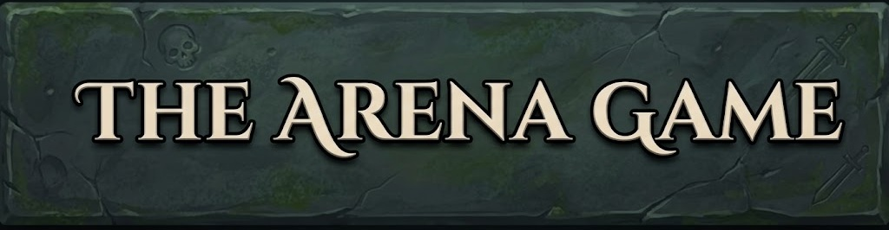
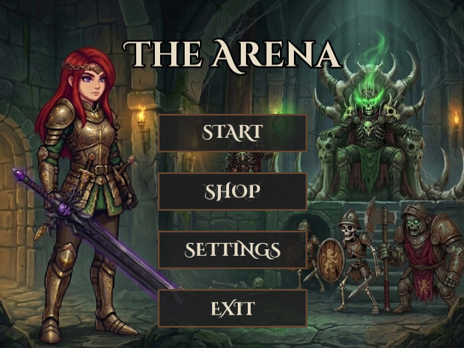
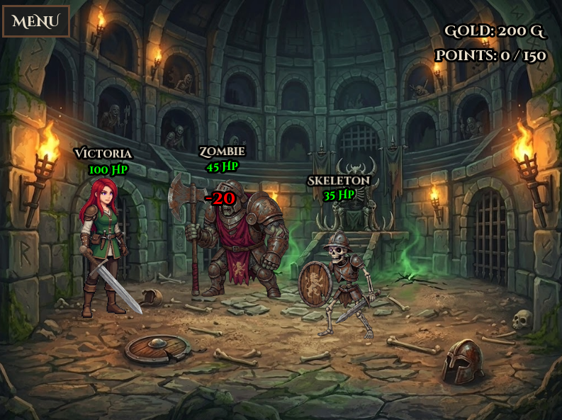
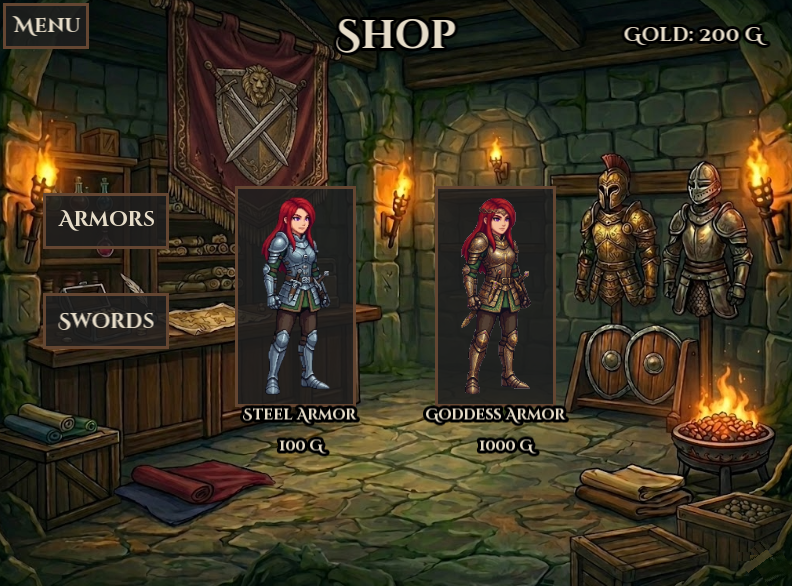
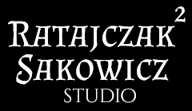

  

The Arena Game jest to turowa gra 2D z elementami RPG, napisana w języku C++ z wykorzystaniem biblioteki graficznej SFML. Gracz mierzy się z kolejnymi falami przeciwników, ulepszając swój ekwipunek pomiędzy starciami.

## Widok gry
### Menu główne

  

### Walka

  

### Sklep

  

## Sterowanie
* **Lewy Przycisk Myszy:** Wybór opcji w menu, zakup przedmiotów w skelpie, wybór ataku oraz wskazanie przeciwników na arenie.

## Użyte technologie
* **Język główny:** C++
* **Biblioteka graficzna:** SFML 2.6.2
* **Kompilator:** MinGW GCC x86 13.1.0
* **Środowisko:** Code::Blocks 25.3
* **System operacyjny:** Windows 11

## Kluczowe funkcjonalności
* **System walki turowej** z różnymi typami ataków (Basic, Reckless, Risky, Combo).
* **Dynamiczne skalowanie trudności** i system fal przeciwników.
* **Sklep** pozwalający na zakup lepszego pancerza i broni za zdobyte złoto.
* **Solidna architektura** oparta na maszynie stanów i polimorfizmie.
* **Zapis i odczyt** stanu gry z pliku.
* **Komunikaty** potwierdzające wykonanie kluczowych operacji.

## Architektura i zrealizowane zagadnienia

Projekt został zrealizowany z naciskiem na dobre praktyki programowania strukturalnego i obiektowego, wykorzystując m.in.:

* **Polimorfizm i dziedziczenie:** Klasa bazowa Enemy oraz dziedziczące po niej klasy konkretnych przeciwników (`np. Boss`, `Skeleton`).

* **Algorytmy STL:** Wykorzystanie m.in. `std::find_if`, `std::remove`, `std::remove_if` do zarządzania logiką wektorów.

* **Dynamiczna alokacja pamięci:** Zarządzanie obiektami przeciwników oraz wykorzystanie inteligentnych wskaźników `std::unique_ptr` w mechanice sklepu.

* **Zarządzanie strumieniami:** System zapisu i odczytu stanu gry (`Złoto`, `Punkty`, `Ekwipunek`) za pomocą biblioteki <fstream>.

## Instrukcja kompilacji i uruchomienia
Aby poprawnie skompilować i uruchomić grę, postępuj zgodnie z poniższymi krokami:

1. **Środowisko:** Zainstaluj najnowszą wersję środowiska IDE **Code::Blocks**.
2. **Repozytorium:** Pobierz repozytorium projektu i wypakuj je w wybranym miejscu docelowym.
3. **Struktura katalogów:** Otwórz główny folder projektu (`ARENA_GAME`) i utwórz w nim nowy podkatalog o nazwie `ext`.
4. **Instalacja SFML:** Pobierz bibliotekę graficzną **SFML w wersji 2.6.2** i wypakuj jej zawartość do utworzonego wcześniej folderu `ext`.
5. **Kompilator (Ważne!):** Biblioteka SFML 2.6.2 może nie współpracować poprawnie z najnowszymi dystrybucjami kompilatora MinGW. Do poprawnej kompilacji zalecana jest instalacja i użycie sprawdzonej wersji: **MinGW GCC 13.1.0**.

## Dokumentacja i organizacja pracy
W trakcie realizacji projektu wypracowano profesjonalne podejście do pracy grupowej, opierające się na:
* **Ścisłym podziale zadań:** Wyraźne określenie ról w zespole (m.in. projekt bazowego silnika, implementacja logiki wrogów, przygotowanie interfejsu).
* **Wewnętrznej dokumentacji i komentarzach:** Przygotowano dedykowany dokument techniczny dla zespołu opisujący działanie bazowych klas, a kluczowe mechaniki opatrzono komentarzami w kodzie.
* **Architekturze opartej na UML:** Strukturę obiektową (dziedziczenie, relacje między modułami) zaprojektowano i udokumentowano za pomocą szczegółowego diagramu klas.

## Autorzy

  

**Zespół:** Mikołaj Ratajczak, Zuzanna Ratajczak, Filip Sakowicz

**Kontekst:** Projekt zrealizowany w ramach zaliczenia laboratorium z przedmiotu **Programowanie Strukturalne i Obiektowe** dla 2. semestru kierunku **Automatyka i Robotyka** realizowanego na **Politechnice Poznańskiej**.